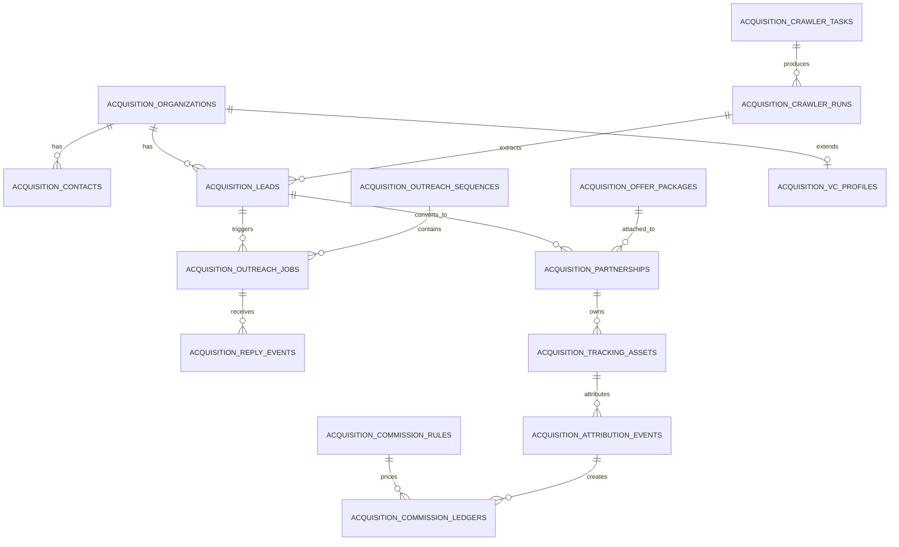

# Multi-Channel Acquisition Module Design

## 1. Current implementation status

The repo already has three useful building blocks:

1. Public lead crawling and outreach draft generation
   - `lib/market/acquisition-distribution.ts`
   - `app/market/acquisition/distribution/distribution-client.tsx`
   - `app/api/market/admin/acquisition/distribution/route.ts`
   - Current scope:
     - can load imported leads from `config/market/acquisition-leads.example.json`
     - can switch to live providers like `tavily`, `serper`, or `webhook`
     - extracts public contacts only
     - batches email sending only for public email contacts
     - generates segment-aware outreach drafts for blogger, B2B, and VC leads
     - classifies reply text in the client into `positive`, `needs_info`, `negotiating`, `negative`, or `manual_review`

2. SMTP-based outreach sending
   - `lib/market/send-email.ts`
   - `app/api/market/admin/profile/route.ts`
   - Current scope:
     - region-aware SMTP account selection
     - runtime SMTP override support from the admin profile API
     - graceful fallback when SMTP credentials are missing

3. Invite code, coupon, and reward tracking
   - `lib/market/referrals.ts`
   - `lib/market/invite-program.ts`
   - `lib/market/marketing.ts`
   - Current scope:
     - 8-character user referral code
     - share-link tracking, click tracking, signup binding
     - invite reward events for signup, first order, and 7-day login streak
     - partner invitation codes and coupons in the marketing console
     - partner benefit months, coupon discount rate, and order commission rate fields already exist

## 2. Current gaps

The current implementation is strong enough for lead discovery demos and invite reward operations, but it does not yet behave like a full acquisition operating system.

Main gaps:

- crawler tasks are not persisted as first-class scheduled jobs
- extracted leads are not normalized into a shared partner/contact/lead graph
- outreach replies are analyzed in the UI, but not stored as persistent reply events
- "move to partnership stage" is currently a UI action, not a durable pipeline transition
- invite codes and coupons exist, but there is no unified partnership record that ties them to contracts, launch state, and settlement
- commission logic is configurable in concept, but not stored as a commission rule plus attribution ledger
- ad revenue snapshots and competitor ad-slot research are not part of one time-series model
- VC fit and AI-generated contact drafts are not stored as reusable profile artifacts

## 3. Target module goal

Build a single acquisition module that supports four partner pipelines:

- blogger alliance marketing
- enterprise procurement and BD
- advertiser / ad revenue monitoring
- VC outreach

The module should unify:

- source discovery
- lead qualification
- outreach and follow-up
- partnership activation
- invite / coupon / tracking asset creation
- attribution and commission settlement
- ad revenue monitoring
- VC preference matching and AI drafting

## 4. Domain model

The proposed core domain contract is captured in:

- `lib/market/acquisition-multichannel-types.ts`
- `config/market/acquisition-multichannel-rules.example.json`

Recommended storage entities:

| Entity | Purpose | Key relationships |
| --- | --- | --- |
| `acquisition_rule_sets` | Global and per-channel config | referenced by crawler, outreach, commission, VC drafting |
| `acquisition_organizations` | Partner company / blogger / fund profile | parent of contacts, leads, partnerships |
| `acquisition_contacts` | Public or introduced contact methods | belongs to organization |
| `acquisition_leads` | Qualification state for a specific opportunity | links organization, contact, crawler run |
| `acquisition_crawler_tasks` | Configurable crawl jobs | parent of crawler runs |
| `acquisition_crawler_runs` | Execution log for one crawl run | parent of extracted leads |
| `acquisition_outreach_templates` | Draft templates and AI prompt anchors | used by outreach jobs |
| `acquisition_outreach_sequences` | Multi-step follow-up sequences | parent of outreach jobs |
| `acquisition_outreach_jobs` | One sent or queued message | belongs to lead |
| `acquisition_reply_events` | Stored inbound replies and AI interpretation | belongs to lead / outreach job |
| `acquisition_offer_packages` | What we offer to bloggers / enterprise / VC | referenced by partnerships |
| `acquisition_partnerships` | Durable cooperation pipeline record | links lead, contract, launch state |
| `acquisition_tracking_assets` | Unique link, coupon, invite code, QR | belongs to partnership |
| `acquisition_attribution_events` | Signup / order / renewal attribution | belongs to tracking asset / partnership |
| `acquisition_commission_rules` | Revenue share logic by order type | used by commission ledger |
| `acquisition_commission_ledgers` | Settlement-ready commission records | belongs to attribution event |
| `acquisition_ad_revenue_snapshots` | Time-series ad income data | per platform/account/day |
| `acquisition_competitor_ad_slots` | Competitor ad slot crawl records | independent research feed |
| `acquisition_vc_profiles` | VC focus, check size, thesis, preferences | extends organization |
| `acquisition_ai_drafts` | AI-personalized outreach drafts | references organization/contact/template |
| `acquisition_event_logs` | Cross-entity audit log | append-only trail |

## 5. Relationship model

High-level relationship graph:

## 6. Event flow

### 6.1 Blogger alliance flow

1. Scheduler picks an active `acquisition_crawler_task` with `targetType=blogger`.
2. One `acquisition_crawler_run` is created and fetches candidate pages.
3. Extracted public contacts are normalized into:
   - `acquisition_organizations`
   - `acquisition_contacts`
   - `acquisition_leads`
4. Qualification rules score the lead by:
   - follower range
   - platform match
   - region match
   - public contact quality
   - content fit score
5. Outreach sequence generates a personalized email or manual DM draft.
6. When a reply arrives, a persistent `acquisition_reply_event` is stored.
7. Positive or negotiating replies auto-create or update one `acquisition_partnership`.
8. Once approved, the system creates:
   - one `acquisition_offer_package`
   - one or more `acquisition_tracking_assets`
   - optional `marketing invitation code`
   - optional `marketing coupon`
9. User signup and orders create `acquisition_attribution_events`.
10. Matching `acquisition_commission_ledgers` are generated from commission rules.

### 6.2 Enterprise procurement flow

1. Crawl or import B2B targets into organization/contact/lead entities.
2. Run qualification against role, region, demand, and budget.
3. Create outreach jobs for email or manual BD follow-up.
4. Positive reply triggers proposal stage.
5. Proposal stage attaches:
   - offer package
   - contract template key
   - legal review flag
6. Contract signed moves partnership to `active`.
7. Enterprise orders produce attribution events and, if applicable, commission or BD incentive ledgers.

### 6.3 Advertiser / ad revenue flow

1. Scheduled pull from ad platform APIs writes `acquisition_ad_revenue_snapshots`.
2. Competitor page crawls write `acquisition_competitor_ad_slots`.
3. Alert rules compare:
   - revenue trend
   - eCPM / CPC shifts
   - competitor bid changes
4. Resulting insights can spawn outreach leads for advertiser BD.

### 6.4 VC flow

1. Crawl firm pages, fund directories, and public partner contacts.
2. Store base org/contact/lead records plus one `acquisition_vc_profile`.
3. AI reads:
   - fund thesis
   - geography
   - stage focus
   - portfolio fit
4. AI draft is persisted as one `acquisition_ai_draft`.
5. Human review sends outreach using a VC sequence.
6. Reply events move the lead into intro call, follow-up, or close-lost states.

## 7. Configurable rules

The rules file should be editable without schema changes.

Minimum configurable groups:

- follower thresholds
- platform and region priority
- blogger offer defaults
- commission rates by order type
- crawler target sites
- crawler selectors
- crawler frequency
- max batch email count
- manual-review thresholds
- legal review thresholds
- ad revenue fetch schedule
- competitor crawl schedule
- VC preference scoring
- AI draft tone and required sections

Seed example:

- `config/market/acquisition-multichannel-rules.example.json`

## 8. How this fits current code

Recommended incremental implementation path:

### Phase 1

- keep using `acquisition-distribution.ts` for discovery
- add persistent storage tables for organizations, contacts, leads, crawler tasks, crawler runs
- replace in-memory reply analysis with persisted `acquisition_reply_events`

### Phase 2

- wire `acquisition_partnerships` to existing marketing invitation code and coupon APIs
- generate one tracking link and one coupon per approved partner
- emit attribution events from existing signup and payment hooks

### Phase 3

- add commission rules and settlement ledger
- add ad revenue snapshots and competitor ad crawl records
- add VC profile store and AI-draft persistence

## 9. Important implementation note

The current "move to partnership stage" behavior in `distribution-client.tsx` is only a UI toast.

To support real automation, that action must become:

1. write `acquisition_reply_event`
2. compute next stage from rule set
3. create or update `acquisition_partnership`
4. optionally enqueue contract, invite-code, and coupon generation
5. append one `acquisition_event_log` record

## 10. Invite code integration strategy

The invite system should remain shared infrastructure, not a separate silo.

Use existing components:

- `lib/market/referrals.ts` for 8-character referral/share codes
- `lib/market/invite-program.ts` for invite reward progression
- `lib/market/marketing.ts` for partner invitation codes and coupons

Recommended binding rules:

- each approved blogger partnership gets one partner invitation code
- each blogger audience package gets one linked coupon or linked audience code
- each tracking asset carries campaign, medium, content, and partner IDs
- signup and order attribution always write back to the acquisition partnership
- commission settlement reads from attributed order type plus configured rate
